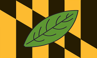
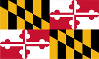
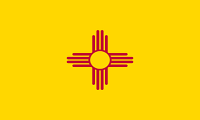
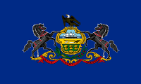

+++
title = "A Tale of Old Bay for Foreigners"
date = "2017-03-10"
image = ["map_usa.png", "map_md.png", "old-bay.png"]
+++

I enjoy reading about other countries and cultures, so it's no surprise I frequent international websites. One reoccurring misconceptions I come across is that non-Americans believe "American" means something beyond national borders.<!--more-->

> Understand any answers to the questions you ask are going to be highly
> different depending on the state and region of where the person lives
>  
> &mdash; Myself, during a U.S. Q&A for Europeans

For non-Americans, it's best to think of U.S. states as independent countries with their own law and culture. Consider *United States* analogous to the European Union. For instance, there's a commonly believed trope that practically all Americans own guns. The state of New Mexico fits this stereotype well, as a lot of its residents can be seen freely walking around with a gun holster on their belt.

In the state of Maryland, that's basically illegal if you're not a police officer. Our gun laws are strict and a sudden change in them would probably cause mass panic and hysteria. That has nothing to do with my personal beliefs, it's just the culture of the state. As you probably guessed, I live there.

Even within Maryland, there's regions with noticeable different culture, accents, and slang words. I live in Calvert County, which is considered part of *Southern Maryland* or the *Tri-County area*. While it's only an hour's drive to D.C. or Baltimore, most Southern Marylanders would scoff at being lumped in with such villainy.

Even food within the U.S. can cause issues if introduced to a different region. There's a Maryland seasoning called [Old Bay](https://en.wikipedia.org/wiki/Old_Bay_Seasoning) that's officially used on seafood. In practice, we put it on everything: hamburgers, french fries, corn on the cob, fried chicken, etc. It's so pervasive that most restaurants by include a can on the table by default.

I let a few of my Pennsylvania friends to try it on Boardwalk Fries, however *Old Bay* is somewhat of an acquired taste (it's made out of paprika, celery salt, and mustard among other things). I would not be exaggerating if I said one friend got physically sick and the rest where convinced I was lying about it's popularity in Maryland.

Expanding our scope illustrates America's differences even clearer. People from the *Deep South* (think Texas, Mississippi, Louisiana, etc.) probably wouldn't understand a *New Englander* (New York, Massachusetts, Maine, etc) if they asked for "[Pop](http://popvssoda.com/)". People moving from the *West Coast* to *East Coast* (or vice versa) are worse off, as they typically experience cultural shock and difficulty fitting in to the same extent of someone who has moved to a foreign country.

While the U.S. certainly doesn't have as big of a population as other countries, it's more of the size of the land in between that causes these regional differences. Going back to humble Calvert County, it's bigger than  [Singapore](https://en.wikipedia.org/wiki/Singapore) or the [Isle of Man](https://en.wikipedia.org/wiki/Isle_of_Man)! Up the scale, and the entire U.S. is larger than Australia, more than double the European Union, and 38 times larger than the British Islands. Now consider the differences within those areas I mentioned and look back at the U.S.

The take home message of all this is that the U.S. is more "diverse" than it is "united". While most Americans never leave the country, they really don't have too. Each state and region has considerable differences in culture, food, and even the law that might as well make it a different country.

## What's with the Flags?
Visitors often common about how the U.S. has flags everywhere. It's absolutely true and I've included a small selection to demonstrate that point. Below are all the flags for the States and Counties I mentioned in this article. Each flag is linked to a respective article describing its history and meaning.

| Location       | Flag                                                        |
| -------------- | ----------------------------------------------------------- |
| Calvert County |  |
| Maryland       |  |
| New Mexico     |  |
| Pennsylvania   |  |
